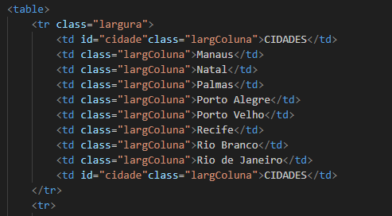
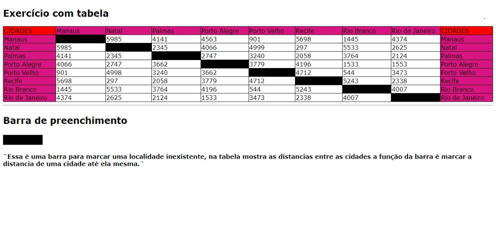

# Projeto - Tabela de Distancia entre capitais brasileiras
 
projeto criado como parte avaliativa da disciplina de fundamentos de desenvolvimento ministrada pelo professor Leornardo Rocha

 ## Índice
* [descricao](#descrição)
* [tecnologia](#tecnologias)
* [referencia](#refêrencia)
* [autor](#autora)

## Descrição 

o projeto consiste na composicao de uma tabela que conta com capitais brasileiras e a distancia entre essas capitais.as capitais constante nesse projeto sao:

* Manaus 
* Natal
* Palmas
* Porto alegre
* Porto velho
* Recife
* Rio branco
* Rio de janeiro
* Salvador

### resultado do projeto

#### Tabela

* table - O elemento <table> HTML representa dados tabulares, ou seja, informações apresentadas numa tabela bidimensional composta por linhas e colunas de células contendo dados

* tr - A tag &lt;tr&gt;, do HTML, serve para definir uma linha dentro de uma tabela. A tag &lt;tr&gt;, que significa "table row", deve estar dentro da tag &lt;table&gt;, que define a tabela. 

veja uma imagem de parte do codigo,onde e possivel indentificar o uso dos elementos mencionados acima:

* td - A tag &lt;td&gt; do HTML serve para criar células de dados em uma tabela. As letras td significam "table data", que é o conteúdo de uma célula de dados. 

#### Estilo

## Tecnologias
* HMTL
* CSS3
* READMW 
* GIT
* GITHUB
 
## Refêrencia
[alura](https://www.alura.com.br/artigos/escrever-bom-readme)-como escrever um readm incrivel no seu github
 
## Autor(a)
projeto realizado: geovanna toledo